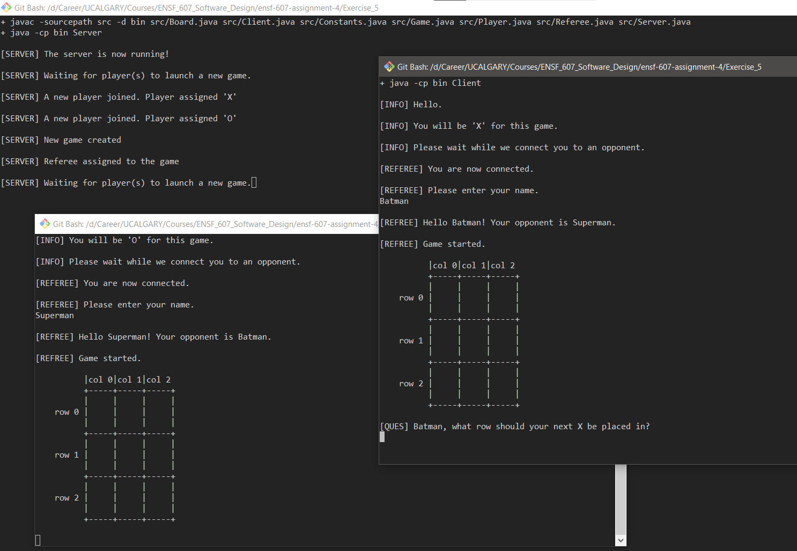

# ENSF-607 Assignment 4

An assignment on multi-threading and client-server architecture.

## Folder Structure

- [Exercise_1](Exercise_1): using `synchronized` to prevent accessing the same resource at the same time by multiple threads
- [Exercise_2](Exercise_2): using multiple threads to generate random numbers and report their sum
- [Exercise_3](Exercise_3): using socket-io for client-server communication for palindrome checks
- [Exercise_4](Exercise_4): using socket-io for client-server communication for getting date/time
- [Exercise_5](Exercise_5): extending Tic-Tac-Toe done in [Assignment 2](https://github.com/meng-ucalgary/ensf-607-assignment-2) to support multiple players using socket-io. Launch the server by running [`run_server.sh`](Exercise_5/run_server.sh). Launch atleast two individual clients using [`run_client.sh`](Exercise_5/run_client.sh).

## Screenshots

Exercise 5:

